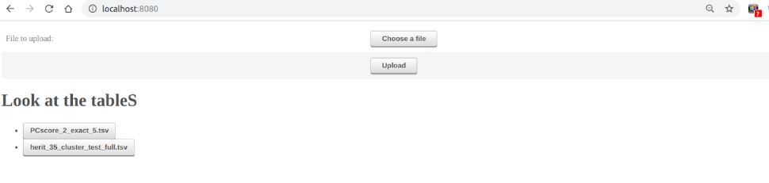
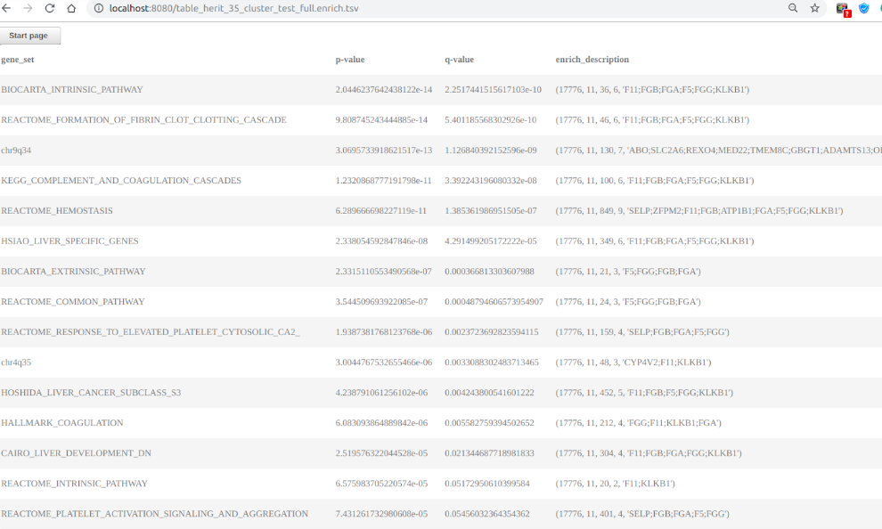

# Project goal:
Network analysis of genetic interactions and the search for relationships between traits and tissues / cell types using GWAS data.

# Tasks:
1. Search for the optimal method of quantification of the association of a gene with a phenotype (gene score) using GWAS UK Biobank summary statistics.  
2. Network analysis
3. Analysis of the relationship of signs and tissues / cell types
4. Web interface for functional annotation of GWAS data using other GWAS data.


# Search for the optimal method of quantification of the association of a gene with a phenotype (gene score) using GWAS UK Biobank summary statistics. 
## a brief description of the methods used;
+ PASCAL (https://www2.unil.ch/cbg/index.php?title=Pascal)
+ `gene_scoring.py` - a script for testing several methods of gene scoring. It requires an annotation file, which was created as described in "snp_genes_annotation.txt" file.
+ `pascal_init.py` - processes UK Biobank phenotype summary statistics and runs PASCAL-tool on it. + `parallel_gene_scoring.sh` was used to run Pascal in parallel on all phenotypes.
+ GSEA (https://www.gsea-msigdb.org/gsea/msigdb/index.jsp)
+ closest-features utility from BEDOPS toolkit (https://bedops.readthedocs.io/en/latest/content/reference/set-operations/bedops.html)
+ `manhatan_plot_for_genes.R` - code for manhatten plot for genes.
+ `gene_sets.R` - summarised data from enrichment analyzes for all gene scoring methods

## system requirements for the developed software (memory / CPU requirements, required version of the operating system, interpreter, libraries, etc.);
python 3.6 (modules: gzip, math, os, sys, subprocess), R 3.6.2 (packages used: ggplot2, dplyr, qqman, RColorBrewer), closest-features 2.4.37.
## instructions for launching the developed software (for a console application - description of startup keys, examples of commands with selected keys);
+ `gene_scoring.py`: python3 gene_scoring.py <path to the phenotype file> <method>
Scoring_methods: sum_sqrt, sum_abs, sum_not_abs, min_pvalue, second_min
requires snp-gene annotation file in the script directory.
+ `pascal_init.py`: There are some problems with specifying the path to the file that need to be fixed. It works only from a folder with Pascal.

## examples of results obtained using software (text, graphs, tables, etc.);
Results of quantification for two phenotypes can be found in gene_scoring/enrichment_data/.

# Network analysis
### a brief description of the methods used:
Hierarchical clustering, GSEA, SAFE-graphs visualisation
### system requirements for the developed software: 
python 3.6, 16Gb RAM
### instructions for launching the developed software:
```
pip install matplotlib sklearn numpy pandas scipy networkx tqdm jupyter
jupyter notebook network_analysis/Network_analysis.ipynb
```
### examples of results obtained using software 
you can see in network_analysis/Network_analysis.ipynb


# Analysis of the relationship of signs and tissues / cell types
## a brief description of the methods used
A script `tiss_diff_exp.R` was written to determine tissue-specific differential expression of genes important for the development of a phenotype of interest. It takes an input file from the median gene-level TPM by tissue and a folder containing files with genescores, and on the basis of r-package fgsea that implements an algorithm for fast gene set enrichment analysis, calculates statistics for this phenotype and all used tissues. 
To evaluate the precence of association of the phenotype with tissue based on this statistics and create a matrix, thanks to which it is possible to compare the associations of tissues with several phenotypes, a script `phen_tissues.R` was written. It takes a directory with stastics files as an input and output is a matrix in which each pair of tissue-phenotype corresponds to either 1 (there is a significant relationship between gene expression in a given tissue and phenotype) or 0 (there is no significant relationship). The resulting matrix was used for further visualization and hierarchical clustering using Phantasus v1.5.1
There some additional scripts that were used:
+ `del_rowscols_withonly_0.R` that deletes all rows and columns consisting of only 0
+ `phen_tissues_padj_matr.R` like the tiss_diff_exp.R, it creates a matrix, but for each pair tissue-phenotype does not match 0 or 1, but the p-value adjasted from the results of the fgsea analysis
+ `rename_ph_num_to_descr.R` renames the names of phenotypes in the matrix from code to semantic

## system requirements for the  all developed software 
+ required version of the operating system: Linux 18.04
+ interpreter: R version 3.6.2
+ libraries: data.table v1.12.8, dplyr v0.8.3, ggplot2 v3.2.1, tidyr v1.0.0, BiocManager 1.30.1, fgsea 1.12.0

## `tiss_diff_exp.R`
### instructions for launching
args[\*] arguments:
args[1] - unziped file.gct with TPM by tissue
args[2] - directory that contain summary genescore files (phen_number.sum.genescores.txt) 
          for phenotypes of interest (outputs of Pascal)

Output is a directory named 'fgseaRes' that contains files with names 
<phen_number>.fgseaRes.csv that contains fgsea statistics

Example:
```
$ ls sum_genescores/
> n_1.sum.genescores.txt n_2.sum.genescores.txt n_3.sum.genescores.txt

$ R tiss_diff_exp.R TPM_by_tissue.gct sum_genescores/
> fgseaRes/

$ ls fgseaRes/
> n_1.fgseaRes.csv n_2.fgseaRes.csv n_3.fgseaRes.csv
```
## `phen_tissues.R`
### instructions for launching
args[\*] arguments:
args[1] - name of directory that contains files with names <phen_number>.fgseaRes.csv that contains fgsea statistics

Example:
```
$ ls fgseaRes/
n_1.fgseaRes.csv n_2.fgseaRes.csv n_3.fgseaRes.csv
$ phen_tissues.R fgseaRes/
```

### examples of results
The script produces a table in `.csv` format, in which tissue is used as columns and phenotypes as rows, and cells are filled with either 0 or 1. Output is a matrix in which each pair of tissue-phenotype corresponds to either 1 (there is a significant relationship between gene expression in a given tissue and phenotype) or 0 (there is no significant relationship).

## `del_rowscols_withonly_0.R`
this script is run through the R development environment (for example, RStudio), and the name of the file with the matrix is manually entered into its code, from which it is necessary to remove zero columns and rows. Output - a matrix in which there are no zero rows and columns.

## `phen_tissues_padj_matr.R`
This script works exactly the same as the phen_tissues.R, but instead of 0 and 1, the matrix is filled with p-values adjasted from the statistics of fgsea analises.

## `rename_ph_num_to_descr.R`
For further analysis of the matrix in Phantasus, it is necessary to rename the names of phenotypes from code to semantic. This script is launched from the development environment R and the code needs to be edited manually and the file name with the matrix, as well as the name of the file with the decoding of the phenotype names, should be entered there.

# Веб-интерфейс для функциональной аннотации GWAS-данных с использованием других GWAS-данных.
According to the GWAS data, it’s nice to give out information about (this is what we want):
* what molecular pathways and sets of genes are associated with its trait
* what previously done GWAS experiments are similar to his experiment
* which modules of genetic architecture are involved in its trait.
**Languages** : *Java* (+ *Python* - language of tools)
**Framework**: *Spring* + *Thymeleaf*
Unfortunately, difficulties arose (for example, the need to refine *LSEA*, difficulties in writing), so for now there is only a semi-working version that should soon work.
It is not possible to start a server on a laptop (as well as *LSEA* itself), therefore a server is needed (or maybe 16+ RAM).
*Interface:*

Analysis:



# references to the used databases
Data used as median gene-level TPM by tissue data:
https://storage.googleapis.com/gtex_analysis_v8/rna_seq_data/GTEx_Analysis_2017-06-05_v8_RNASeQCv1.1.9_gene_median_tpm.gct.gz

Used annotation of human genome:
ftp://ftp.ebi.ac.uk/pub/databases/gencode/Gencode_human/release_19/gencode.v19.annotation.gtf.gz

Summary statistics for all phenotypes and background information about them here:
https://docs.google.com/spreadsheets/d/1kvPoupSzsSFBNSztMzl04xMoSC3Kcx3CrjVf4yBmESU/edit?ts=5b5f17db#gid=227859291
